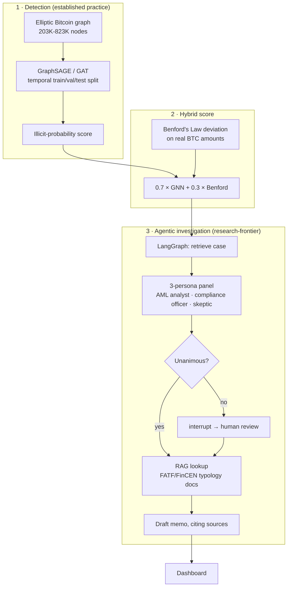

# FraudGraph

[](https://github.com/Niveditha-04/fraudgraph/actions/workflows/tests.yml)

**Live demo:** https://niv04-fraudgraph.static.hf.space/

A two-layer fraud detection system on the Elliptic Bitcoin transaction graph: a Graph Neural Network that spots suspicious wallet neighborhoods, and an LLM-based investigation agent that reviews each flagged case through a 3-persona panel before drafting a memo — routing to human review whenever the panel disagrees, rather than silently guessing.

Full gate-by-gate results, including everything that didn't go perfectly, are in [VALIDATION_REPORT.md](VALIDATION_REPORT.md).

## The problem

Real financial crime — money laundering, coordinated fraud rings — moves money across *networks* of accounts specifically so no single transaction looks suspicious on its own. Row-by-row transaction monitoring structurally cannot see this: the pattern only exists at the network level. This is established practice in the industry (regulators like FATF explicitly call for network-based analytics), not a novel idea — what's newer is combining it with an LLM-based investigation layer on top, a combination first published (as "FLAG") at KDD 2025.

## Architecture



The detection layer (GNN on a transaction graph) is standard industry practice. The investigation layer (LLM persona panel + human-in-the-loop routing on disagreement) is the newer, less-established half — this distinction is kept honest throughout the results below, not blurred.

## Results (honest metrics — precision / recall / AUC-PR, never accuracy)

With illicit at ~2-10% of the data depending on denominator, a model predicting "licit" for everything scores >90% accuracy while catching zero fraud. Every result below is precision/recall/AUC-PR on a **temporal** holdout split (train on early time steps, test on later ones) — a random split would leak future information into training.

**Base Elliptic (203,769 nodes):**

| Model | Precision | Recall | AUC-PR |
|---|---|---|---|
| Logistic Regression (no graph) | 0.150 | 0.835 | 0.220 |
| GraphSAGE | 0.673 | 0.539 | **0.542** |
| GAT | 0.115 | 0.753 | 0.372 |

**Elliptic++ (822,942 wallet nodes, optional scale extension):**

| Model | Precision | Recall | AUC-PR |
|---|---|---|---|
| Logistic Regression (no graph) | 0.064 | 0.849 | 0.126 |
| GraphSAGE | 0.096 | 0.978 | **0.428** (undertrained — see report) |
| GAT | 0.154 | 0.886 | 0.362 |

GraphSAGE beats the non-graph baseline by ~2.5x on both datasets — the graph structure is doing real work, not just adding noise.

**Benford's Law correlation:** r = 0.042 (p = 2×10⁻²⁸) between Benford deviation and the GNN score — statistically significant (large sample) but practically negligible. Reported as-is; a near-zero correlation is itself a valid finding, not a failure.

**Investigation agent:** run on 10 real test cases (3 illicit / 7 licit ground truth) — 6 of 10 triggered human review because the persona panel disagreed. Not one case reached unanimous "illicit" consensus, which turns out to be an honest finding about the panel's calibration given thin per-wallet evidence, not a bug — full breakdown in the validation report.

## Repository layout

```
data/     Elliptic / Elliptic++ loading, validation gates, EDA
models/   GraphSAGE, GAT, baseline, Benford's Law, hybrid score
rag/      AML typology PDFs → Chroma vector store
agent/    LangGraph investigation agent (persona panel, human review, memo)
api/      FastAPI backend (local/live use)
dashboard/ Static dashboard (deployed) + Pyvis subgraph rendering
tests/    pytest suite (runs in CI on push/PR/weekly)
```

## Running locally

```bash
python3.11 -m venv .venv && source .venv/bin/activate
pip install -r requirements.txt
```

```bash
# Phase 1-2: data validation + EDA
python -m data.eda_phase2

# Phase 3: train GraphSAGE/GAT vs. baseline on base Elliptic
python -m models.run_phase3

# Phase 5: build the RAG vector store (needs the PDFs in rag/documents/)
python -m rag.build_vectorstore

# Phase 6: run the investigation agent (needs ANTHROPIC_API_KEY in .env)
python -m agent.run_phase6

# Phase 7: local dashboard with a live FastAPI backend
uvicorn api.main:app --reload
```

## Tooling

PyTorch + PyTorch Geometric (GraphSAGE/GAT), LangChain 1.x / LangGraph 1.x (`create_agent`, `StateGraph`, native `interrupt()`-based human-in-the-loop), Chroma via `langchain-chroma`, local HuggingFace embeddings (no API key needed for RAG), FastAPI, Pyvis.

## What this project is not claiming

The GNN fraud-detection method is standard industry practice, not novel — graph-based AML analytics is explicitly called for by FATF and used in real enforcement (e.g. DOJ's Operation Gold Rush). The genuinely newer part is the agentic investigation layer stacked on top of it.
