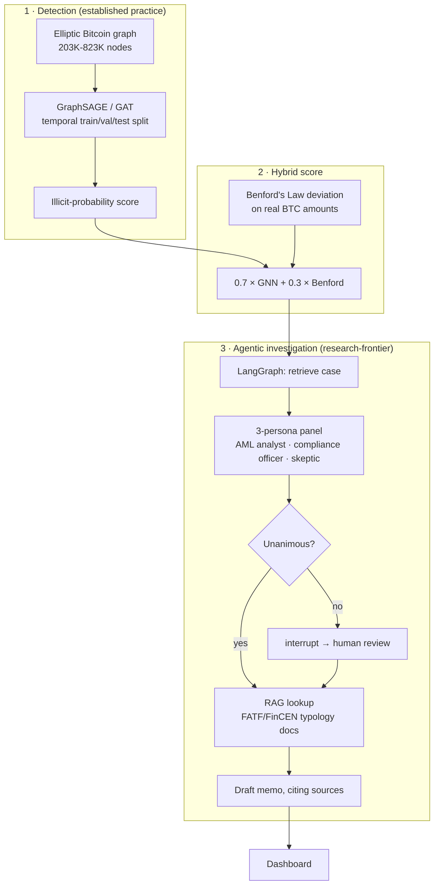

# FraudGraph

[](https://github.com/Niveditha-04/fraudgraph/actions/workflows/tests.yml)

**Explore 10 investigated cases (static, pre-computed — not a live scoring endpoint):** https://niv04-fraudgraph.static.hf.space/

A two-layer fraud detection system on the Elliptic Bitcoin transaction graph: a Graph Neural Network that spots suspicious wallet neighborhoods, and an LLM-based investigation agent that reviews each flagged case through a 3-persona panel before drafting a memo — routing to human review whenever the panel disagrees.

Gate-by-gate results: [VALIDATION_REPORT.md](VALIDATION_REPORT.md). Dataset provenance: [DATASET.md](DATASET.md).

## The problem

Money laundering and coordinated fraud rings move money across *networks* of accounts specifically so no single transaction looks suspicious on its own. Row-by-row transaction monitoring can't see this — the pattern only exists at the network level. Graph-based AML analytics is established industry practice (FATF calls for it explicitly); the newer part is combining it with an LLM investigation layer on top, a combination first published (as "FLAG") at KDD 2025.

## Architecture



The detection layer (GNN on a transaction graph) is standard industry practice. The investigation layer (LLM persona panel with human-in-the-loop routing on disagreement) is the newer, less-established half.

## Results

Metrics are precision / recall / AUC-PR, never accuracy — illicit is 2-10% of the data depending on denominator, so a model predicting "licit" for everything scores >90% accuracy while catching zero fraud. All splits are temporal (train on early time steps, test on later ones); a random split leaks future information into training.

**Base Elliptic (203,769 nodes):**

| Model | Precision | Recall | AUC-PR |
|---|---|---|---|
| Logistic Regression (no graph) | 0.150 | 0.835 | 0.220 |
| GraphSAGE | 0.673 | 0.539 | **0.542** |
| GAT | 0.115 | 0.753 | 0.372 — not viable at this precision (~88% false-alarm rate); shown for comparison, not as a deployable option |

**Elliptic++ (822,942 wallet nodes, optional scale extension):**

| Model | Precision | Recall | AUC-PR |
|---|---|---|---|
| Logistic Regression (no graph) | 0.064 | 0.849 | 0.126 |
| GraphSAGE | 0.096 | 0.978 | **0.428** — undertrained, see Known limitations |
| GAT | 0.154 | 0.886 | 0.362 |

GraphSAGE beats the non-graph baseline by ~2.5x on both datasets — the graph structure carries real signal.

**Benford's Law correlation:** r = 0.042 (p = 2×10⁻²⁸) between Benford deviation and the GNN score, on 70,487 test nodes — statistically significant at this sample size, practically negligible.

**Hybrid score (0.7×GNN + 0.3×Benford), evaluated as a combined classifier:**

| Score | Precision | Recall | AUC-PR |
|---|---|---|---|
| GNN alone | 0.096 | 0.978 | **0.428** |
| Benford alone | 0.038 | 0.773 | 0.038 |
| Hybrid (0.7/0.3) | 0.080 | 0.977 | 0.232 |

The hybrid score underperforms the GNN alone. Benford's near-zero correlation with the GNN score means blending it in adds noise rather than complementary signal at this weighting. See `models/evaluate_hybrid_score.py`.

**Investigation agent:** run on 10 test cases (3 illicit / 7 licit ground truth) — 6 of 10 triggered human review on panel disagreement. No case reached unanimous "illicit" consensus. See Known limitations.

## Repository layout

```
data/     Elliptic / Elliptic++ loading, validation gates, EDA
models/   GraphSAGE, GAT, baseline, Benford's Law, hybrid score
rag/      AML typology PDFs → Chroma vector store
agent/    LangGraph investigation agent (persona panel, human review, memo)
api/      FastAPI backend (local/live use)
dashboard/ Static dashboard (deployed) + Pyvis subgraph rendering
tests/    pytest suite (runs in CI on push/PR/weekly)
```

## Running locally

```bash
python3.11 -m venv .venv && source .venv/bin/activate
pip install -r requirements.txt
```

```bash
# Phase 1-2: data validation + EDA
python -m data.eda_phase2

# Phase 3: train GraphSAGE/GAT vs. baseline on base Elliptic
python -m models.run_phase3

# Phase 5: build the RAG vector store (needs the PDFs in rag/documents/)
python -m rag.build_vectorstore

# Phase 6: run the investigation agent (needs ANTHROPIC_API_KEY in .env;
# optionally LANGCHAIN_TRACING_V2=true, LANGCHAIN_API_KEY, LANGCHAIN_PROJECT
# for LangSmith tracing)
python -m agent.run_phase6

# Phase 7: local dashboard with a live FastAPI backend
uvicorn api.main:app --reload
```

## Tooling

PyTorch + PyTorch Geometric (GraphSAGE/GAT), LangChain / LangGraph (`create_agent`, `StateGraph`, `interrupt()`-based human-in-the-loop), Chroma via `langchain-chroma`, local HuggingFace embeddings for RAG, FastAPI, Pyvis.

## Known limitations

- The hybrid score underperforms the GNN alone (see Results) — the combined-score step is implemented and runnable, not yet shown to add value at its current weighting.
- GAT is not viable at its current precision on either dataset — included for comparison, not as a deployable option.
- The Elliptic++ GraphSAGE run is undertrained: capped at 25 epochs by a memory constraint while validation AUC-PR was still climbing (0.36→0.71 in its last 5 logged epochs). Its 0.428 AUC-PR is a floor, not a converged result.
- No operating threshold has been chosen against a false-positive budget — all metrics above are at the default 0.5 threshold. A real deployment picks a threshold based on how many flags a compliance team can review per day and reports metrics there.
- The investigation agent has not demonstrated it can confirm fraud unanimously on its own — across 10 test cases, verdicts were either unanimous "licit" or a disagreement routed to human review, never unanimous "illicit." The panel is given aggregate wallet statistics, not real subgraph/neighbor context, which is the likely cause.
- n=10 test cases is too small to draw statistical conclusions about panel reliability — it demonstrates the human-review mechanism triggers, not that the panel's judgment holds up at scale.
- No prompt-injection or adversarial-input handling. Retrieved RAG text and case evidence flow into LLM prompts unsanitized — untested against manipulated input.

## What this project is not claiming

The GNN fraud-detection method is standard industry practice, not novel — graph-based AML analytics is explicitly called for by FATF and used in real enforcement (e.g. DOJ's Operation Gold Rush). The agentic investigation layer stacked on top of it is the newer part.
