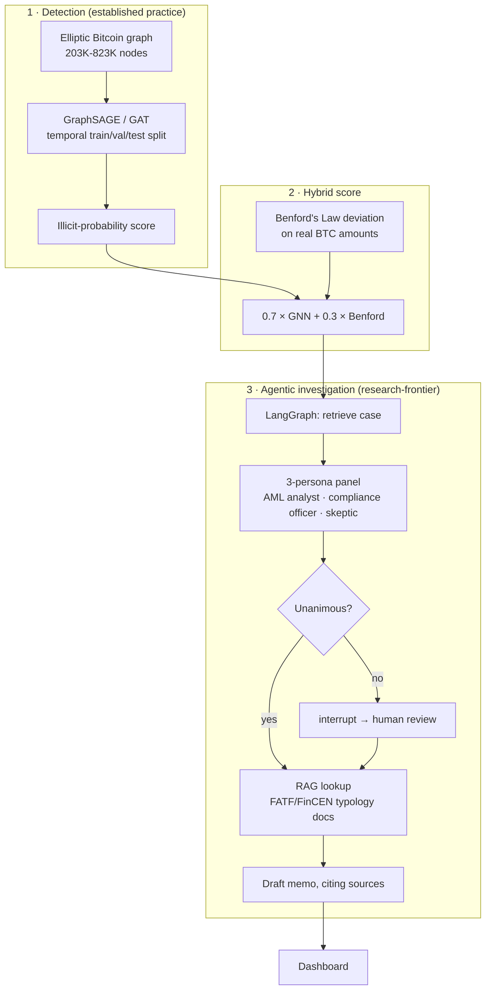

# FraudGraph

[](https://github.com/Niveditha-04/fraudgraph/actions/workflows/tests.yml)

**Explore 10 investigated cases (live, static — pre-computed, not a live scoring endpoint):** https://niv04-fraudgraph.static.hf.space/

A two-layer fraud detection system on the Elliptic Bitcoin transaction graph: a Graph Neural Network that spots suspicious wallet neighborhoods, and an LLM-based investigation agent that reviews each flagged case through a 3-persona panel before drafting a memo — routing to human review whenever the panel disagrees, rather than silently guessing.

Full gate-by-gate results, including everything that didn't go perfectly, are in [VALIDATION_REPORT.md](VALIDATION_REPORT.md). For what the underlying data actually is, who created it, and how — see [DATASET.md](DATASET.md).

## The problem

Real financial crime — money laundering, coordinated fraud rings — moves money across *networks* of accounts specifically so no single transaction looks suspicious on its own. Row-by-row transaction monitoring structurally cannot see this: the pattern only exists at the network level. This is established practice in the industry (regulators like FATF explicitly call for network-based analytics), not a novel idea — what's newer is combining it with an LLM-based investigation layer on top, a combination first published (as "FLAG") at KDD 2025.

## Architecture



The detection layer (GNN on a transaction graph) is standard industry practice. The investigation layer (LLM persona panel + human-in-the-loop routing on disagreement) is the newer, less-established half — this distinction is kept honest throughout the results below, not blurred.

## Results (honest metrics — precision / recall / AUC-PR, never accuracy)

With illicit at ~2-10% of the data depending on denominator, a model predicting "licit" for everything scores >90% accuracy while catching zero fraud. Every result below is precision/recall/AUC-PR on a **temporal** holdout split (train on early time steps, test on later ones) — a random split would leak future information into training.

**Base Elliptic (203,769 nodes):**

| Model | Precision | Recall | AUC-PR |
|---|---|---|---|
| Logistic Regression (no graph) | 0.150 | 0.835 | 0.220 |
| GraphSAGE | 0.673 | 0.539 | **0.542** |
| GAT | 0.115 | 0.753 | 0.372 — **not viable as configured**: ~88% of every GAT flag is a false alarm at this precision. Shown for comparison, not as a deployable peer of GraphSAGE. |

**Elliptic++ (822,942 wallet nodes, optional scale extension):**

| Model | Precision | Recall | AUC-PR |
|---|---|---|---|
| Logistic Regression (no graph) | 0.064 | 0.849 | 0.126 |
| GraphSAGE | 0.096 | 0.978 | **0.428** (undertrained — see report) |
| GAT | 0.154 | 0.886 | 0.362 |

GraphSAGE beats the non-graph baseline by ~2.5x on both datasets — the graph structure is doing real work, not just adding noise.

**Benford's Law correlation:** r = 0.042 (p = 2×10⁻²⁸) between Benford deviation and the GNN score — statistically significant (large sample) but practically negligible. Reported as-is; a near-zero correlation is itself a valid finding, not a failure.

**The hybrid score itself (0.7×GNN + 0.3×Benford), evaluated directly, not just its two ingredients in isolation:**

| Score | Precision | Recall | AUC-PR |
|---|---|---|---|
| GNN alone | 0.096 | 0.978 | **0.428** |
| Benford alone | 0.038 | 0.773 | 0.038 |
| Hybrid (0.7/0.3) | 0.080 | 0.977 | 0.232 |

**Honest finding: the hybrid score performs *worse* than the GNN alone (AUC-PR 0.232 vs. 0.428).** Given Benford's near-zero correlation with the GNN score above, blending it in adds noise rather than complementary signal at this weighting, on this dataset. The architecture diagram above shows the hybrid step as designed; it has not been shown to add value as currently weighted, and this is reported plainly rather than left untested. See `models/evaluate_hybrid_score.py`.

**Investigation agent:** run on 10 real test cases (3 illicit / 7 licit ground truth) — 6 of 10 triggered human review because the persona panel disagreed. Not one case reached unanimous "illicit" consensus, which turns out to be an honest finding about the panel's calibration given thin per-wallet evidence, not a bug — full breakdown in the validation report.

## Repository layout

```
data/     Elliptic / Elliptic++ loading, validation gates, EDA
models/   GraphSAGE, GAT, baseline, Benford's Law, hybrid score
rag/      AML typology PDFs → Chroma vector store
agent/    LangGraph investigation agent (persona panel, human review, memo)
api/      FastAPI backend (local/live use)
dashboard/ Static dashboard (deployed) + Pyvis subgraph rendering
tests/    pytest suite (runs in CI on push/PR/weekly)
```

## Running locally

```bash
python3.11 -m venv .venv && source .venv/bin/activate
pip install -r requirements.txt
```

```bash
# Phase 1-2: data validation + EDA
python -m data.eda_phase2

# Phase 3: train GraphSAGE/GAT vs. baseline on base Elliptic
python -m models.run_phase3

# Phase 5: build the RAG vector store (needs the PDFs in rag/documents/)
python -m rag.build_vectorstore

# Phase 6: run the investigation agent (needs ANTHROPIC_API_KEY in .env)
python -m agent.run_phase6

# Phase 7: local dashboard with a live FastAPI backend
uvicorn api.main:app --reload
```

## Tooling

PyTorch + PyTorch Geometric (GraphSAGE/GAT), LangChain 1.x / LangGraph 1.x (`create_agent`, `StateGraph`, native `interrupt()`-based human-in-the-loop), Chroma via `langchain-chroma`, local HuggingFace embeddings (no API key needed for RAG), FastAPI, Pyvis.

## Known limitations (not fixed yet — stated plainly, not buried)

- **The hybrid score underperforms the GNN alone** (see above) — the combined-score step in the architecture diagram is implemented and runnable, but not yet shown to add value at its current weighting.
- **GAT is not viable as configured** on either dataset (very low precision) — included for comparison, not as a deployable option.
- **The Elliptic++ GraphSAGE run is undertrained**, capped at 25 epochs by a real memory constraint while validation AUC-PR was still climbing (0.36→0.71 in its last 5 logged epochs) — its 0.428 AUC-PR is a floor, not a converged result.
- **No operating threshold was chosen against a false-positive budget.** All metrics above are computed at the default 0.5 classification threshold; a real deployment would pick a threshold based on how many flags a compliance team can actually review per day, and report metrics there instead.
- **The investigation agent has not yet demonstrated it can confidently confirm fraud on its own** — across the 10 test cases run, verdicts were only ever unanimous "licit" or a disagreement routed to human review, never unanimous "illicit." The evidence given to the panel is aggregate wallet statistics, not real subgraph/neighbor context, which is the most likely cause — but that's a diagnosis, not a fix.
- **n=10 test cases for the agent evaluation is too small to draw statistical conclusions from** — it demonstrates the mechanism works (the human-review branch genuinely triggers), not that the panel's judgment is reliable at scale.
- **No adversarial/prompt-injection handling.** Retrieved RAG document text and case evidence both flow into LLM prompts unsanitized. In an adversarial domain like AML, a manipulated transaction memo or a poisoned reference document could plausibly influence the agent's output — this was not addressed or tested.

## What this project is not claiming

The GNN fraud-detection method is standard industry practice, not novel — graph-based AML analytics is explicitly called for by FATF and used in real enforcement (e.g. DOJ's Operation Gold Rush). The genuinely newer part is the agentic investigation layer stacked on top of it.
