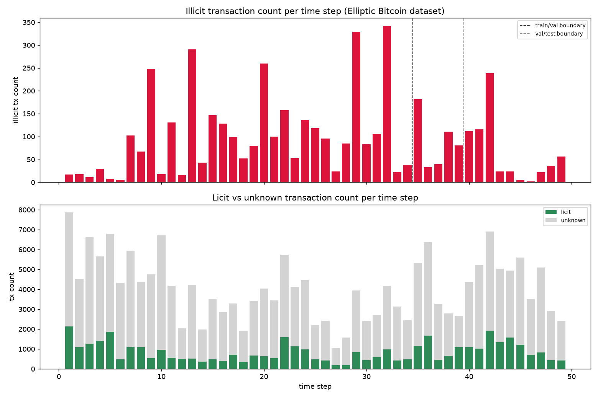

# FraudGraph — Validation Report

Every phase gate from the build guide: what it required, what was measured, whether it passed. Numbers are read from the committed result files (`models/results/*.json`, `agent/results/phase6_results.json`).

## Phase 0 — Environment

**Required:** `pip freeze` matches `requirements.txt` exactly.
**Result:** Fresh venv installed from `requirements.txt` alone matches `pip freeze` exactly — 151 packages.
**Status: PASS**

## Phase 1 — Data acquisition and validation

**Required:** node count 203,769 / edge count 234,355 / 49 time steps / illicit ≈4,545 (±50) / licit ≈42,019 (±50).

| Check | Actual | Expected | Match |
|---|---|---|---|
| Nodes | 203,769 | 203,769 | exact |
| Edges | 234,355 | 234,355 | exact |
| Time steps | 49 | 49 | exact |
| Illicit | 4,545 | 4,545 (±50) | exact |
| Licit | 42,019 | 42,019 (±50) | exact |

**Status: PASS**, exact match on every figure.

## Phase 2 — Graph construction and EDA

**Required:** printed class imbalance shows illicit ≈2% of labeled nodes.
**Result:** Illicit is 2.2% of all 203,769 nodes, matching the brief's "~2%" figure — but 9.76% of the 46,564 *labeled* nodes. The gate's wording conflates the two figures. Phase 3's loss weighting uses the labeled-only ratio (9.76%), not 2%.

Unlabeled ("unknown") transactions outnumber labeled-licit ones in every one of the 49 time steps — the ratio ranges 1.4x to 8.0x, averaging 4.3x (see the bottom panel of the chart below). This is why the labeled-only ratio, not the all-nodes ratio, is the correct one for loss weighting: the model never sees unlabeled nodes in its loss regardless of how numerous they are.

**Status: PASS**

## Phase 3 — GNN model training (base Elliptic, 203,769 nodes)

**Required:** best GNN's test AUC-PR exceeds the Logistic Regression baseline's, same split.

| Model | Precision | Recall | AUC-PR (test) |
|---|---|---|---|
| Logistic Regression (baseline) | 0.150 | 0.835 | 0.2198 |
| GraphSAGE | 0.673 | 0.539 | **0.5424** |
| GAT | 0.115 | 0.753 | 0.3716 |

**Status: PASS** — GraphSAGE beats the baseline by ~2.5x. GraphSAGE's val AUC-PR (0.849) is well above its test AUC-PR (0.542).

This is partly explained by extreme per-timestep volatility in illicit transaction counts, not a smooth distribution shift: within the test window (t40-49), timestep 46 has only 2 illicit transactions and timestep 45 has 5, while timestep 42 has 239 — a ~120x range. AUC-PR computed across the whole test window mixes near-empty and dense timesteps rather than reflecting stable performance on a uniform distribution.

**Threshold analysis** (`models/threshold_analysis.py`): the precision/recall pairs above are both at the default 0.5 threshold, uncalibrated per model. Retraining both models (same seed, config unchanged — reproduced the exact precision/recall/AUC-PR above, confirming determinism) and selecting each model's F1-maximizing threshold on the validation set only (never the test set), then applying it to test:

| Model | Threshold | Precision | Recall | F1 |
|---|---|---|---|---|
| GraphSAGE | 0.50 (default) | 0.673 | 0.539 | 0.599 |
| GraphSAGE | 0.83 (F1-max) | 0.784 | 0.497 | 0.608 |
| GAT | 0.50 (default) | 0.115 | 0.753 | 0.199 |
| GAT | 0.93 (F1-max) | 0.552 | 0.316 | 0.402 |

GAT's default-threshold precision (0.115) is substantially a threshold artifact: at its own optimal threshold it reaches 0.552 precision, more than quadrupling, and F1 more than doubles (0.199→0.402). GraphSAGE's improvement at its optimal threshold is comparatively modest. This does not change which model is better — GraphSAGE still wins on AUC-PR (threshold-independent) and still has the higher F1 even at GAT's best threshold — but the magnitude of "GAT is unusable" in the default-threshold numbers overstates the actual gap between the two models.

## Phase 3.5 — Elliptic++ scale extension (822,942 wallet nodes, optional)

**Required:** completed or explicitly skipped, both result sets reported side by side.

| Model | Precision | Recall | AUC-PR (test) |
|---|---|---|---|
| Logistic Regression (baseline) | 0.064 | 0.849 | 0.1263 |
| GraphSAGE | 0.096 | 0.978 | **0.4283** |
| GAT | 0.154 | 0.886 | 0.3615 |

**Status: PASS.** Two constraints on this run:
- Trained at `hidden_dim=16`, capped at 25 epochs (vs. base Elliptic's 128/300). A full-batch run at the base-Elliptic config thrashed this machine's memory (`sysctl vm.swapusage` confirmed real system-level pressure, not a code bug). `NeighborLoader` mini-batch sampling — the standard fix — requires `pyg-lib`/`torch-sparse`, neither of which has an installable build for this torch version in this environment.
- GraphSAGE's best epoch was 25, the exact cap — val AUC-PR was still climbing (0.36→0.71 in its last 5 logged epochs). 0.4283 is a floor, not a converged result.

## Phase 4 — Hybrid statistical score

**Required:** a printed correlation between Benford's Law deviation and the GNN score.

Base Elliptic's 165 features are anonymized by the dataset's own documentation, so Benford's Law cannot run meaningfully on them. This phase uses Elliptic++'s real BTC amount fields instead, paired with the Phase 3.5 GraphSAGE model's per-node scores.

**Result: Pearson r = 0.0416 (p = 2.06×10⁻²⁸), n = 70,487.** Statistically significant at this sample size, practically negligible — the two signals are largely independent rather than redundant.

**Hybrid score (0.7×GNN + 0.3×Benford), evaluated as a combined classifier** (`models/evaluate_hybrid_score.py`):

| Score | Precision | Recall | AUC-PR |
|---|---|---|---|
| GNN alone | 0.096 | 0.978 | 0.428 |
| Benford alone | 0.038 | 0.773 | 0.038 |
| Hybrid (0.7/0.3) | 0.080 | 0.977 | **0.232** |

**Status: PASS** on the printed-correlation requirement. **The hybrid score underperforms the GNN alone** (AUC-PR 0.232 vs. 0.428).

The "Benford alone" row above is Benford's own precision/recall/AUC-PR against the ground-truth illicit label directly, not just its correlation with the GNN score. Illicit is 4.49% of this test set (3,167/70,487); Benford's standalone AUC-PR (0.038) is below that base rate, meaning Benford's Law deviation predicts the ground-truth label at or below chance level on its own. Combined with its near-zero correlation to the GNN score, this is not "unvalidated" — it's a confirmed non-predictive signal being given 30% weight in the hybrid score, which is the direct cause of the hybrid score's underperformance.

## Phase 5 — RAG knowledge base

**Required:** 5-10 public AML typology PDFs, chunked/embedded into Chroma, 5 test queries each returning a relevant chunk.

**Corpus:** 5 PDFs (FATF Virtual Assets Red Flag Indicators 2020, FATF Updated VASP Guidance 2021, FinCEN CVC Advisory 2019, FinCEN CVC Guidance 2019, FinCEN CVC Kiosk Notice 2025) — 189 pages, 735 chunks.

| # | Query | Verdict |
|---|---|---|
| 1 | structuring pattern to avoid reporting thresholds | relevant |
| 2 | layering funds through multiple unhosted wallet hops | relevant — near-verbatim match ("virtual-to-virtual layering schemes...") |
| 3 | mixing or tumbling services to obscure transaction origin | relevant |
| 4 | convertible virtual currency kiosk scam typology | relevant — top hit is the source document itself |
| 5 | red flag indicators for virtual asset service providers | relevant — top hit is the source document itself |

**Status: PASS (5/5).** Query 2's original phrasing ("layering through shell companies") returned weak matches — this corpus is crypto-specific, not general AML material. Rephrased to "layering funds through multiple unhosted wallet hops," which retrieves a strong match; both phrasings are in `rag/test_retrieval.py`.

## Phase 6 — LangGraph investigation agent

**Required:** ≥10 test cases, mix of illicit/licit ground truth, `needs_human_review` demonstrated to trigger.

**Result: 10/10 cases run, 3 illicit / 7 licit ground truth, 6/10 triggered human review.**

| Case | Ground truth | Hybrid score | Persona verdicts | Status | Final verdict |
|---|---|---|---|---|---|
| 0 | licit | 0.367 | licit, licit, licit | auto_finalized | licit |
| 1 | licit | 0.526 | uncertain, licit, uncertain | human_resolved | uncertain |
| 2 | illicit | 0.074 | licit, licit, licit | auto_finalized | licit |
| 3 | licit | 0.698 | licit, uncertain, uncertain | human_resolved | uncertain |
| 4 | licit | 0.002 | licit, licit, licit | auto_finalized | licit |
| 5 | illicit | 1.000 | uncertain, uncertain, licit | human_resolved | uncertain |
| 6 | licit | 0.266 | licit, licit, licit | auto_finalized | licit |
| 7 | licit | 0.999 | uncertain, uncertain, uncertain | human_resolved | uncertain |
| 8 | illicit | 0.867 | uncertain, licit, uncertain | human_resolved | uncertain |
| 9 | licit | 0.844 | licit, licit, uncertain | human_resolved | licit |

Case 2 (wallet #572167) is a genuine illicit wallet the panel unanimously and confidently classified as licit — GNN score 0.002, all three personas at 0.88-0.92 confidence, auto-finalized with no human review triggered. The wallet's surface pattern (7 inbound transactions, 0 outbound) looks like ordinary passive receiving activity; underneath it's confirmed fraud. This is a concrete instance of the GNN's 0.428 test AUC-PR producing a real false negative, not just a number on its own.

**Status: PASS against the stated gate** (≥10 cases, mix of ground truth, human-review branch triggers). That's narrower than "the agent works as designed." No case reached unanimous "illicit" across all 10 — verdicts were either unanimous "licit" or a disagreement. As evaluated, the panel escalates reliably but has not demonstrated it can confirm fraud on its own. The panel is given aggregate wallet statistics, not subgraph structure, and many flagged wallets are single-transaction wallets — thin evidence, and the likely cause, though that's a diagnosis rather than a fix. n=10 is too small to draw statistical conclusions about panel reliability at scale; it demonstrates the human-review mechanism works.

The memo-drafting call's `max_tokens` was set too low (800): LangSmith traces showed every call consuming exactly 800 output tokens, and the saved memo text confirmed each memo was cut off mid-sentence. Raised to 2500; all 10 memos now end on a complete sentence.

## Phase 7 — Dashboard and deployment

**Required:** deployed URL loads and shows a working example end-to-end from a fresh browser session.

**Result:** Live at **https://niv04-fraudgraph.static.hf.space/**, verified from a cold browser session: all 10 cases load, case-switching works, scores/persona panel/memo/subgraph visualization render with real data.

**Status: PASS.** The FastAPI+Docker version couldn't deploy to HF Spaces' free tier — Docker/Gradio Spaces require a paid PRO subscription there; only static Spaces are free. Deployed as a static site serving pre-exported JSON instead, which also satisfies the brief's requirement that the demo work without live API credits. The FastAPI backend (`api/main.py`) remains in the repo for local/live use.

## Phase 8 — Documentation

This report + `README.md` + `DATASET.md` + `.github/workflows/tests.yml` (12 tests: unit tests for the metrics/Benford math, plus an integration test re-verifying the Phase 1 data-validation gate against the live dataset; runs on push, PR, and weekly).

---

## LLM token usage / cost

LangSmith tracing is enabled (`LANGCHAIN_TRACING_V2=true`, project `Fraudgraph`) and covers all calls made after it was wired in, including one full Phase 6 gate re-run and the memo-drafting fix below.

**Measured (LangSmith, `run_type=llm` only — excludes LangGraph's node/chain-level wrapper traces to avoid double-counting):** 41 LLM calls, 58,102 input tokens, 14,773 output tokens, $0.1961 total. 10 calls on `claude-sonnet-5` (24,127 input / 8,000 output tokens, $0.1283) and 31 calls on `claude-haiku-4-5-20251001` (33,975 input / 6,773 output tokens, $0.0678).

This covers only the traced portion of the build (one full Phase 6 run plus setup calls), not the earlier untraced runs (initial Phase 6 gate runs, the 3-case smoke test). Total cost across the whole build, including untraced calls, is estimated at $0.50-0.70.

## Known gaps not addressed in this repo

- Thresholds are F1-optimal (see Phase 3's threshold analysis), not chosen against a deployment false-positive budget — a real deployment picks a threshold based on how many flags a compliance team can actually review per day, which may differ from the F1-maximizing point.
- The persona panel receives aggregate wallet statistics, not real subgraph/neighbor context.
- Agent evaluation is n=10; not large enough for statistical conclusions about panel reliability.
- No prompt-injection or adversarial-input testing — retrieved RAG text and case evidence flow into LLM prompts unsanitized.
- Elliptic++ GraphSAGE has not been trained to convergence (see Phase 3.5).
- No automated RAG evaluation harness — Phase 5's check is 5 manually-read queries. Ragas was attempted; both the latest release (0.4.3) and the last version known to work with current LangChain (0.3.9) fail to import, because ragas unconditionally imports `langchain_community.chat_models.vertexai`, a module removed from current `langchain-community` (tracked upstream in ragas issues #2745/#2753). Not resolved by pinning an older ragas version, since the incompatibility is with this project's `langchain-community` version, not ragas's.
